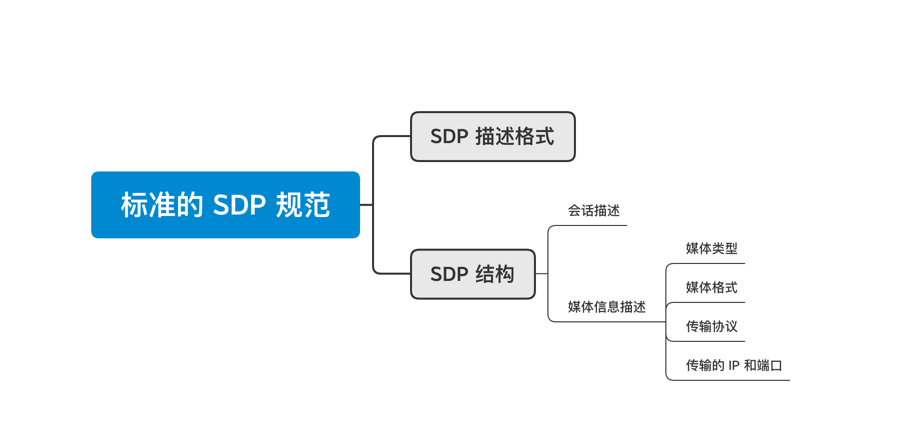

# SDP 的交换

交换 SDP 的目的是为了让对方知道彼此具有哪些能力，然后根据双方各自的能力进行协商，协商出大家认可的音视频编解码器、编解码器相关的参数（如音频通道数，采样率等）、传输协议等信息。

举个例子，A 与 B 进行通讯，它们先各自在 SDP 中记录自己支持的音频参数、视频参数、传输协议等信息，然后再将自己的 SDP 信息通过信令服务器发送给对方。当一方收到对端传来的 SDP 信息后，它会将接收到的 SDP 与自己的 SDP 进行比较，并取出它们之间的交集，这个交集就是它们协商的结果，也就是它们最终使用的音视频参数及传输协议了。

# 标准的 SDP 规范

标准 SDP 规范主要包括 SDP 描述格式和 SDP 结构，而 SDP 结构由会话描述和媒体信息描述两个部分组成。

